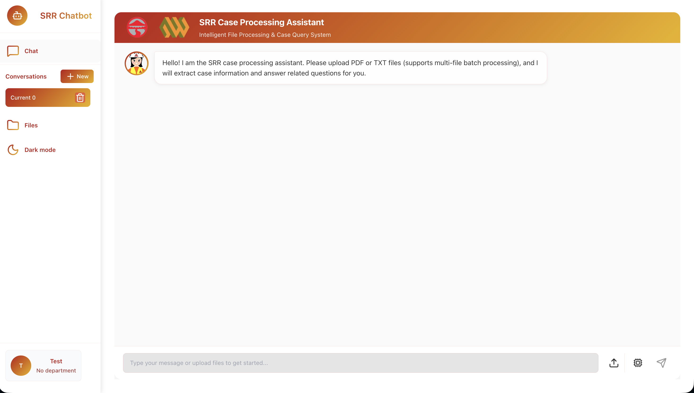
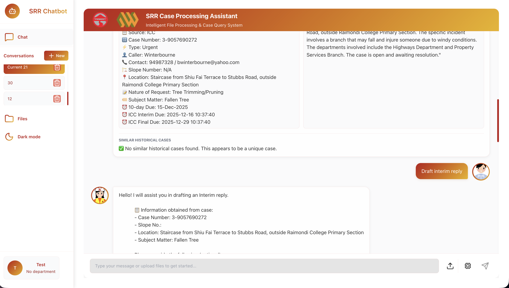
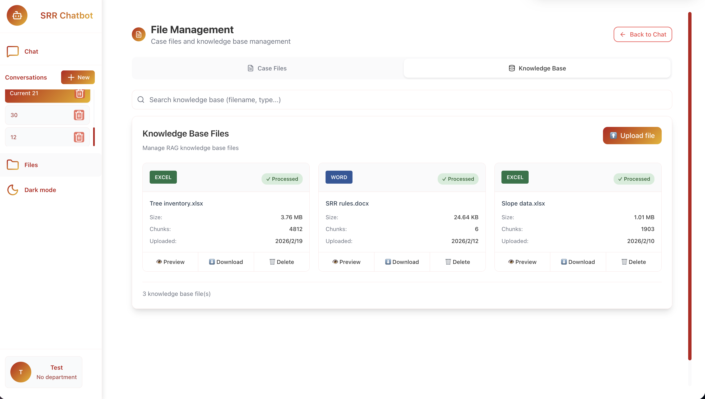

# SRR Agentic Case Processing System

[](https://www.python.org/downloads/)
[](https://fastapi.tiangolo.com/)
[](https://reactjs.org/)
[](https://github.com/pgvector/pgvector)
[](https://cloud.google.com/run)

An AI-powered system for processing SRR (Slope Repair Request) cases from multiple government channels — ICC (1823), TMO, and RCC — built on a 7-layer Agentic Processor architecture with 17 pluggable atomic abilities.

## Overview

The system automates the full SRR workflow: multi-format file parsing → field extraction (A–Q) → department routing → similar case retrieval → summary generation → reply draft, with quality evaluation and self-repair at each step.

## Key Capabilities

| Capability | Description |
|---|---|
| **Multi-channel parsing** | ICC (TXT), TMO (PDF/DOCX Form1/Form2), RCC (scanned PDF + OCR), Vision image parser |
| **18-field extraction** | A–Q fields extracted via schema-driven LLM, with `fill_missing` multi-file fallback |
| **Department routing** | SMRIS-based slope responsibility lookup, multi-slope split detection |
| **Similar case retrieval** | Hybrid vector + weighted rerank (location 50% / slope 30% / caller 20%) |
| **Reply generation** | Reply Slip V02 structured output (ACK / INT / SUB series), bilingual |
| **Quality evaluation** | 3-layer funnel: L1 keyword → L2 rules → L3 RAGAS LLM-as-Judge |
| **Self-repair** | Best-of-N comparison, 4 failure-type differential rollback strategies |
| **3-layer memory** | Task (TaskState) / Case (SessionState) / Domain (correction feedback) |
| **Knowledge base** | pgvector RAG with user-correction feedback loop |

## Architecture

```
┌──────────────────────────────────────────────────────────────────────────────────────┐
│  L1  Input Adapter   FileSorter → ICC/TMO/RCC extractors + Vision parser             │
│  L2  Intent Router   6 intents: create_case / search_history / generate_reply /      │
│                      chat_query / check_status / greeting                            │
│  L3  Ability Layer   17 atomic abilities, condition-driven via process_case()         │
│  L4  Memory          TaskState (task) · SessionState (case) · Domain (corrections)   │
│  L5  Data & KB       PostgreSQL + pgvector: cases · entities · knowledge_docs        │
│  L6  External Data   SMRIS · GeoInfo · HKO (with local fallback)                    │
│  L7  Output          A–Q JSON · AI summary · similar cases · reply draft · SSE       │
└──────────────────────────────────────────────────────────────────────────────────────┘
```


## Screenshots

| Main Interface | Interaction Display | Knowledge Base |
|:---:|:---:|:---:|
|  |  |  |

## Project Structure

```
project3/
├── README.md
├── WORKFLOW_DESIGN.md              # System architecture and process flow
├── start.py                        # Local dev startup script
├── docker-compose.yml
├── docker-compose.dev.yml
├── smoke/                          # Smoke tests (9 buckets)
│   └── README.md
├── backend/
│   ├── Dockerfile
│   ├── app.py                      # ASGI entry point
│   ├── alembic/                    # DB migrations
│   │   └── versions/               # 8 migration files (2026-02 to 2026-03)
│   ├── config/
│   │   ├── settings.py
│   │   └── requirements.txt
│   ├── src/
│   │   ├── agent/
│   │   │   ├── abilities/          # 17 atomic abilities
│   │   │   ├── graph.py            # process_case() orchestration
│   │   │   ├── nodes.py            # Intent classification, decomposition
│   │   │   ├── state.py            # AgentState, IntentType
│   │   │   ├── task_state.py       # TaskState dataclass
│   │   │   ├── evaluators.py       # KeywordEvaluator, RagasEvaluator
│   │   │   └── tools.py            # AgentTooling
│   │   ├── api/
│   │   │   ├── main.py
│   │   │   ├── middleware.py
│   │   │   ├── dependencies.py
│   │   │   └── routes/             # auth · cases · chat · files · knowledge_base · system
│   │   ├── core/
│   │   │   ├── extractFromTxt.py   # ICC extractor
│   │   │   ├── extractFromTMO.py   # TMO Form1/Form2/Hazardous extractor
│   │   │   ├── extractFromRCC.py   # RCC OCR extractor
│   │   │   ├── vision_image_parser.py
│   │   │   ├── pg_vector_store.py
│   │   │   └── embedding.py
│   │   ├── services/               # Business logic services
│   │   ├── database/               # DB manager and models
│   │   └── utils/
│   │       ├── file_sorter.py      # 6-type file classification
│   │       ├── input_adapter.py    # ParsedDocument, ZIP expansion
│   │       └── field_schema.py     # A–Q field schema definitions
│   ├── data/
│   │   └── rag_files/              # Uploaded KB files
│   └── tests/                      # Unit tests
└── frontend/srr-chatbot/           # React + TypeScript frontend
```

## Quick Start

### Production (Cloud Run)

```bash
cd backend
gcloud run deploy my-app \
  --source . \
  --region=us-central1 \
  --memory=4Gi \
  --timeout=400 \
  --add-cloudsql-instances=srr-pipeline:us-central1:srr-project-db \
  --allow-unauthenticated
```

See [`docs/CLOUD_RUN_DEPLOYMENT.md`](docs/CLOUD_RUN_DEPLOYMENT.md) for full setup including secrets and DB migration.

### Local Development

```bash
# 1. Start PostgreSQL (Cloud SQL Proxy or local)
./cloud-sql-proxy-legacy -instances=srr-pipeline:us-central1:srr-project-db=tcp:5433 &

# 2. Backend
cd backend
pip install -r config/requirements.txt
alembic upgrade head
python app.py

# 3. Frontend
cd frontend/srr-chatbot
npm install && npm start
# → http://localhost:3000
```

### Environment Variables

```bash
OPENAI_API_KEY=sk-...
DATABASE_URL=postgresql+psycopg://...
JWT_SECRET_KEY=...
EMBEDDING_PROVIDER=openai        # openai (Cloud Run) or ollama (local)
RAGAS_ENABLED=false              # set true for L3 eval
```

## Documentation

| Document | Description |
|---|---|
| [`WORKFLOW_DESIGN.md`](WORKFLOW_DESIGN.md) | Architecture flow and ability orchestration |
| [`docs/FEATURES.md`](docs/FEATURES.md) | Feature reference and atomic ability list |
| [`docs/CLOUD_RUN_DEPLOYMENT.md`](docs/CLOUD_RUN_DEPLOYMENT.md) | Deployment guide |
| [`docs/CASE_SIMILARITY_SEARCH.md`](docs/CASE_SIMILARITY_SEARCH.md) | Similarity matching algorithms |
| [`docs/OPT/ARCHITECTURE_IMPLEMENTATION_AUDIT.md`](docs/OPT/ARCHITECTURE_IMPLEMENTATION_AUDIT.md) | Implementation audit (2026-03-16) |
| [`docs/OPT/R1-R18_ACCEPTANCE_REPORT.md`](docs/OPT/R1-R18_ACCEPTANCE_REPORT.md) | R1–R18 requirement coverage |
| [`docs/OPT/MEMORY_STRATEGY.md`](docs/OPT/MEMORY_STRATEGY.md) | 3-layer memory design |
| [`smoke/README.md`](smoke/README.md) | Smoke test workflow |

## R1–R18 Requirement Coverage

| Status | Requirements |
|---|---|
| ✅ Implemented | R1 (orchestration) · R2 (external data) · R4 (referral annotation) · R5 (user feedback) · R8 (self-repair) · R10 (department routing) · R11 (similar cases) · R12 (multi-slope split) · R13 (Reply Slip V02) · R16 (TMO form differentiation) · R18 (duplicate detection) |
| ⚠️ Partial | R3 (multi-channel adapter) · R6 (memory depth) · R7 (eval coverage) · R9 (reply governance) · R14 (KB approval) · R15 (observability) · R17 (test coverage) |

Full detail: [`docs/OPT/R1-R18_ACCEPTANCE_REPORT.md`](docs/OPT/R1-R18_ACCEPTANCE_REPORT.md)

## System Requirements

- **Python 3.11+**
- **Node.js 18+**
- **PostgreSQL 15+ with pgvector extension**
- **OpenAI API Key** (GPT-4o for generation, text-embedding-3-small for embeddings)
- **Google Cloud** project with Cloud Run + Cloud SQL enabled (production)

---

## Contributors

Special thanks to Professor Li for her guidance.

**Iteration 0: v0.0.0**

| Username | GitHub ID | Responsible Modules | Contributions |
|---|---|---|---|
| Zhang Weijian | February13 | core | Project initialization, foundational architecture |

**Iteration 1: v1.0.0 (2026-02-01)**

| Username | GitHub ID | Commits | Lines Added | Lines Deleted | Main Contributions |
|---|---|---|---|---|---|
| Zhang Weijian | February13 | 55 | 59,234 | 17,612 | **Core Feature Development**: Smart pair function, historical case matching, AI functionality<br>**ICC Module**: Date Received, Interim Due, Final Due field logic processing<br>**Cloud Deployment**: Docker compose, Cloud Run, Firebase deployment<br>**RCC/TMO Module**: Prompt optimization, source classification logic refactoring<br>**Frontend Fixes**: Upload, avatar, icons<br>**Documentation & Maintenance**: Code comments, project docs, database module |
| Hou Haochen | HHC-1998 | 3 | 140 | 25 | **RCC Prompt Optimization**: Modified prompts for columns J and R<br>**New RCC Prompt**: Added new prompt configurations for RCC |
| Luo Kairong | jsildf | 5 | 204 | 157 | **Prompt Regex Optimization**: Extract slope no via regex after prompt<br>**TMO and ICC Rules**: Added new rules for TMO and ICC processing<br>**Branch Merge Operations**: Merged branches (collaborated with lkr) |

**Iteration 2: v3.0.0 (2026-02–03)**

| Username | GitHub ID | Commits | Lines Added | Lines Deleted | Main Contributions |
|---|---|---|---|---|---|
| Zhang Weijian | February13 | 12 | 21,196 | 4,862 | Phase 3 architecture upgrade: 7-layer Agentic Processor, 17 atomic abilities, PostgreSQL + pgvector, Cloud Run deployment, Alembic migrations, smoke test suite |

---

**Last Updated**: 2026-03-17
