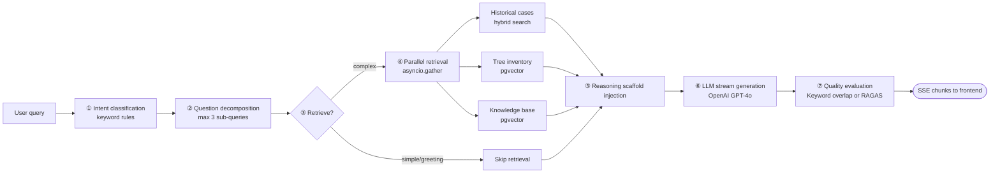

# SRR Agentic Processor — Workflow Design

## System Overview

The SRR Agentic Processor handles slope repair request (SRR) cases from three government channels — ICC (1823), TMO (Tree Management Office), and RCC (Regional Coordinating Centre) — through a 7-layer condition-driven pipeline. Each case file is parsed, field-extracted, enriched with external data, evaluated, and output as structured A–Q fields, an AI summary, similar case references, and a reply draft.

---

## 7-Layer Architecture

```
┌─────────────────────────────────────────────────────────────────────┐
│  Layer 1 · Input Adapter                                            │
│   FileSorter (recursive traversal, ZIP expansion, 6-type routing)   │
│   → ICC extractor · TMO extractor · RCC extractor · Vision parser   │
│   → unified ParsedDocument                                          │
├─────────────────────────────────────────────────────────────────────┤
│  Layer 2 · Intent Router & Task State                               │
│   6 intents: create_case · search_history · generate_reply          │
│              chat_query · check_status · greeting                   │
│   TaskState: fields · missing_fields · steps_done · quality_score   │
├─────────────────────────────────────────────────────────────────────┤
│  Layer 3 · Ability Orchestration  (process_case)                    │
│   17 atomic abilities, condition-driven routing                     │
├─────────────────────────────────────────────────────────────────────┤
│  Layer 4 · Memory                                                   │
│   Task memory (TaskState) · Case memory (SessionState)              │
│   Domain memory (correction knowledge_docs)                         │
├─────────────────────────────────────────────────────────────────────┤
│  Layer 5 · Data & Knowledge  (PostgreSQL + pgvector)                │
│   cases · entities · knowledge_docs · chat_sessions                 │
├─────────────────────────────────────────────────────────────────────┤
│  Layer 6 · External Data                                            │
│   SMRIS · GeoInfo Map · HKO Weather  (with local fallback)          │
├─────────────────────────────────────────────────────────────────────┤
│  Layer 7 · Output                                                   │
│   A–Q JSON · AI summary · similar cases · reply draft · SSE stream  │
└─────────────────────────────────────────────────────────────────────┘
```

---

## create_case Orchestration Flow

The core flow executed by `graph.process_case()` for a case file upload:

```mermaid
flowchart TD
    START([File Upload / Case ID]) --> LOAD[Load existing case from DB if case_id present]
    LOAD --> EXT[extract_fields\nroute by source_type to ICC/TMO/RCC extractor]
    EXT --> FB[user_feedback\ninject correction_hints from domain memory]
    FB --> MISS{missing_fields?}
    MISS -->|Yes| FILL[fill_missing\nmulti-file fallback, Vision attachments]
    MISS -->|No| COMPL
    FILL --> COMPL[check_completeness\nformat rules + semantic consistency]
    COMPL --> ICC{source_type == ICC?}
    ICC -->|Yes| ANNOT[annotate_referral\nparse Assignment + Contact History]
    ICC -->|No| EXT_DATA
    ANNOT --> EXT_DATA[call_external\nSMRIS · GeoInfo · HKO parallel query]
    EXT_DATA --> MULTI{multiple slope candidates?}
    MULTI -->|Yes| SPLIT[multi-slope split\ndetermine department per slope\ngenerate sub_tasks]
    MULTI -->|No| SIM
    SPLIT --> SIM[search_similar_cases\nhybrid vector + weighted rerank]
    SIM --> DUP{source_type == ICC?}
    DUP -->|Yes| DEDUP[detect_duplicate\nparse email title new/repeat marker]
    DUP -->|No| ROUTE
    DEDUP --> ROUTE{G_slope_no present\nand not split?}
    ROUTE -->|Yes| DEPT[route_department\nSMRIS lookup, fuzzy match, multi-dept flag]
    ROUTE -->|No| DEAD
    DEPT --> DEAD[calculate_deadlines\nK/N/O1 code; L/M ICC extracted or fallback]
    DEAD --> SUM[generate_summary\n100-150 char Chinese summary]
    SUM --> EVAL[eval_quality\nL1 keyword → L2 rules → L3 RAGAS]
    EVAL --> SCORE{quality_score?}
    SCORE -->|≥ 0.5| OUT([Output TaskState])
    SCORE -->|0.3-0.5| REPAIR[self_repair\nBest-of-N + differential rollback]
    SCORE -->|< 0.3| FLAG[needs_human_review = true]
    REPAIR --> OUT
    FLAG --> OUT

    style EXT fill:#e8f5e9,stroke:#388e3c
    style EVAL fill:#fff8e1,stroke:#f9a825
    style REPAIR fill:#ffebee,stroke:#c62828
    style SPLIT fill:#e3f2fd,stroke:#1565c0
    style OUT fill:#f3e5f5,stroke:#7b1fa2
```



---

## Chat / RAG Flow

For `chat_query` intent, `stream_chat_events()` runs a separate linear pipeline:



---

## 17 Atomic Abilities

All abilities implement `AbilityInterface` and are registered via `@register_ability`.

### Field Extraction Group
| Ability | Role |
|---|---|
| `extract_fields` | Schema-driven LLM extraction from ParsedDocument, routes ICC/TMO/RCC |
| `fill_missing` | Multi-file fallback: Vision attachments, location maps, referral forms |
| `check_completeness` | Format rules + cross-field semantic consistency |

### Retrieval & Routing Group
| Ability | Role |
|---|---|
| `search_similar_cases` | Hybrid vector + weighted rerank (location 50% / slope 30% / caller 20%) |
| `search_tree` | Exact tree/slope ID lookup + vector supplement |
| `search_knowledge` | pgvector KB retrieval with doc_type filter |
| `route_department` | SMRIS lookup, slope normalization, multi-dept split flag |
| `detect_duplicate` | Email title new/repeat parsing, prior case association |
| `annotate_referral` | Assignment History + Contact History extraction and summary |

### External Query Group
| Ability | Role |
|---|---|
| `call_external` (passthrough) | Parallel SMRIS / GeoInfo / HKO query with local fallback |

### Generation Group
| Ability | Role |
|---|---|
| `generate_summary` | 100–150 char Chinese case summary, LLM + structured context |
| `gen_reply` | Reply Slip V02 structured output: type selection + bilingual body |
| `calculate_deadlines` | K/N/O1 code; ICC L/M preserve extracted values or fallback A+10/21 |
| `chat_answer` | RAG Q&A streaming response |

### Quality Control Group
| Ability | Role |
|---|---|
| `eval_quality` | 3-layer funnel: L1 keyword → L2 rule validator → L3 RAGAS LLM-as-Judge |
| `self_repair` | Best-of-N comparison, 4-type differential rollback (coverage / extraction / faithfulness / routing) |
| `user_feedback` | Save corrections to knowledge_docs (domain memory), inject as correction_hints |

---

## Self-Repair Strategies

| Failure Type | Rollback Path | Strategy |
|---|---|---|
| `coverage_low` | search_similar → search_knowledge → generate_summary | Switch vector → BM25; inject original as negative example |
| `extraction_incomplete` | extract_fields → fill_missing → check_completeness | Switch extractor regex → LLM Vision; verify missing_fields count decreases |
| `faithfulness_low` | generate_summary or gen_reply | strict_grounding prompt + original output as negative example |
| `routing_uncertain` | call_external → route_department | Force-refresh SMRIS, cross-validate GeoInfo, return top-3 candidates |

---

## Data Layer

```
PostgreSQL + pgvector (Cloud SQL: srr-pipeline:us-central1:srr-project-db)

Tables:
  cases               ← case records with A–Q fields
  chat_sessions       ← session state (case memory)
  knowledge_docs      ← KB docs + correction entries (domain memory)
  knowledge_docs_vectors ← pgvector embeddings (doc_type filter)
  chat_quality_metrics   ← RAG quality telemetry per session
  slope_maintenance   ← local SMRIS fallback data

Migrations (Alembic):
  20260215 · 20260220 · 20260221 · 20260225 · 20260314×3 · 20260316
```

---

## Infrastructure

| Component | Technology |
|---|---|
| Backend | FastAPI (Python 3.11), Uvicorn |
| Frontend | React 18 + TypeScript |
| Database | PostgreSQL 15 + pgvector |
| Embedding | OpenAI text-embedding-3-small (or Ollama nomic-embed-text) |
| Generation | OpenAI GPT-4o |
| Deployment | Google Cloud Run (4Gi, 400s timeout) |
| Auth | JWT (Bearer token) |

---

**Last Updated**: 2026-03-17
